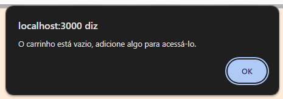
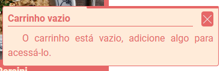

# Adicionando o Framer-Motion ao projeto.
 Instale o framer-motion: `npm install framer-motion`

## Animando a Barra Lateral
Vamos animar a abertura da barra latera:
### Overlay
___
No arquivo de estilo (style.ts): \
Vamos importar o `framer-motion` e criar um elemento junto com o `styled-componens`. O *StyledOverlay* representa o fundo escuro do modal. \
A função *StyledOverlayMotion* retorna um componente react com um elemento motion e suas animações.
> Neste momento a extensão do arquivo deverá ser **.tsx**
```TS
import { motion } from 'framer-motion'

const StyledOverlay = styled(motion.div)`
height: 100vh;
flex: 1;
background-color: rgba(0, 0, 0, 0.8);
cursor: pointer;
`

export function StyledOverlayMotion({ onClick }: { onClick: () => void }) {
  return (
    <StyledOverlay
      onClick={onClick}
      initial={{ x: '100vw' }}
      animate={{ x: 0 }}
      transition={{ type: 'tween' }}
    />
  )
}
```
___
No arquivo do componente SibeBar (index.tsx): \
Vamos importar o componente criado a cima, como ele é renderizado condicionalmente, a animação ocorre de forma automática.
```TS
import StyledSideBar, { StyledOverlayMotion } from './style'

function SideBar() {
  ...

  if (showSibeBar)
    return (
      <StyledSideBar>
        <StyledOverlayMotion ... />
        ...

      </StyledSideBar>
    )
  return null
}
```

### Carrinho
> O carrinho está dividido em 3 partes para animar: o container, a lista de itens e o resumo.

#### O container
No componente *Cart* vamos animar o próprio elemento assim como fizemos com o overlay, começando pelo style:
```TS
import { motion } from 'framer-motion'

const StyledCartContainer = styled(motion.div)`
  ...
`

function StyledCartContainerMotion({ children }: { children: JSX.Element[] }) {
  return (
    <StyledCartContainer
      initial={{ x: 360 }}
      animate={{ x: 0 }}
      transition={{ type: 'tween' }}
    >
      {children}
    </StyledCartContainer>
  )
}
export default StyledCartContainerMotion
```
> Não esqueça de mudar a extensão do arquivo sempre que for usar um componente React nele.
___
Agora no arquivo do componente:
```TS
import StyledCartContainerMotion, { StyledCartResumo } from './style'

function CartContainer() {
  ...

  return (
    <StyledCartContainerMotion>
      ...
    </StyledCartContainerMotion>
  )
}
```

#### O resumo
> Vamos para o último elemento que é tão fácil quanto o primeiro

No arquivo style: \
Vamos apenas transformá-lo num elemento *motion* e aplicaremos as animações durante o uso.
```TS
export const StyledCartResumo = styled(motion.div)`
  ...
`
```
___
No arquivo do componente: \
Vamos importar o elemento criado e aplicar a animação diretamente nele.
```TS
import StyledCartContainerMotion, { StyledCartResumo } from './style'

function CartContainer() {
  ...

  return (
    <StyledCartContainerMotion>
      ...
      {itens.length ? (
        <StyledCartResumo
          initial={{ opacity: 0 }}
          animate={{ opacity: 1 }}
          transition={{ delay: 0.3 }}
        >
          ...
        </StyledCartResumo>
      ) : (
        ...
      )}
    </StyledCartContainerMotion>
  )
}
```
#### A lista de itens
> Na lista de itens no carrinho, iremos adicionar animações 'sequenciais' à lista e aos itens.

Vamos direto ao arquivo no componente:
```TS
import { AnimatePresence, motion, Variants } from 'framer-motion'

const listVariants: Variants = {
  initial: {
    opacity: 0
  },
  final: {
    opacity: 1,
    transition: {
      delay: 0.2,
      duration: 0.5,
      delayChildren: 0.3,
      staggerChildren: 0.1
    }
  }
}

const itemVariants: Variants = {
  initial: {
    opacity: 0,
    y: 20
  },
  final: {
    opacity: 1,
    y: 0,
    transition: {
      ease: 'easeOut'
    }
  }
}

function CartContainer() {
  ...

  return (
    <StyledCartContainerMotion>
      <motion.ul variants={listVariants} initial="initial" animate="final">
        <AnimatePresence>
          {itens.map((item) => {
            return (
              <motion.li
                key={item.id}
                variants={itemVariants}
                exit={{
                  opacity: 0,
                  scale: 0
                }}
              >
                ...

              </motion.li>
            )
          })}
        </AnimatePresence>
      </motion.ul>
      ...

    </StyledCartContainerMotion>
  )
}
```
## Criando Notificações
> Atualmente o projeto usa a função alert() sempre que precisa dar uma notificação ao usuário. \
>  \
> Passaremos a usar cards de notificação. \
>  \
> Passaremos também a notificar quando um item for adcionado ao carrinho, ou quando o mesmo já estiver no carrinho.

Vamos criar o reducer das notificações:
___
Mas antes, declarar a tipagem: \
*src\types.d.ts*
```TS
declare interface NotificationProps {
  id?: number
  title: string
  text: string
}
```
E agora criar o reducer: \
*src\store\reducers\notifications.ts*
```TS
import { createSlice, PayloadAction } from '@reduxjs/toolkit'

type NotificationsStore = {
  itens: NotificationProps[]
}

const initialState: NotificationsStore = {
  itens: []
}

const notificationSlice = createSlice({
  name: 'notifications',
  initialState,
  reducers: {
    addNotif: (state, action: PayloadAction<NotificationProps>) => {
      if (!action.payload.id) action.payload.id = Date.now()
      if (
        state.itens.find((_item) => _item.id === action.payload.id) &&
        action.payload.id == -1
      ) {
        alert('O carrinho está vazio, adicione algo para acessá-lo.')
      } else {
        state.itens.push(action.payload)
      }
    },
    removeNotif: (state, action: PayloadAction<number>) => {
      state.itens = state.itens.filter((item) => item.id !== action.payload)
    }
  }
})

export const { addNotif, removeNotif } = notificationSlice.actions

export default notificationSlice.reducer

```
___
*src\store\index.ts*: \
Adicione o reducer à store:
```TS
import notificationsReducer from './reducers/notifications'

export const cartStore = configureStore({
  reducer: {
    ...
    notificationsReducer,
    ...
  }
})

export type RootReducer = ReturnType<typeof cartStore.getState>
```
___
O container das notificações: \
*src\container\Notifications\index.tsx*
```TS
import { useSelector } from 'react-redux'
import { RootReducer } from '../../store'
import Notification from '../../components/Notification'
import StyledNotificationsContainer from './style'
import { motion, AnimatePresence } from 'framer-motion'

function NotificationsContainer() {
  const notifications = useSelector(
    (state: RootReducer) => state.notificationsReducer.itens
  )
  return (
    <StyledNotificationsContainer>
      <AnimatePresence>
        {notifications.map((value) => {
          return (
            <motion.li layout key={value.id} exit={{ opacity: 0, y: 100 }}>
              <Notification
                title={value.title}
                text={value.text}
                id={value.id}
              />
            </motion.li>
          )
        })}
      </AnimatePresence>
    </StyledNotificationsContainer>
  )
}

export default NotificationsContainer
```
___
*src\container\Notifications\style.ts* \
O estilo
```TS
import { styled } from 'styled-components'

const StyledNotificationsContainer = styled.ul`
  position: fixed;
  bottom: 0;
  right: 0;
  height: min-content;
  width: 360px;
  z-index: 1000;
  margin-bottom: 32px;
  margin-right: 16px;

  display: flex;
  flex-direction: column;
  row-gap: 8px;
`

export default StyledNotificationsContainer

```
___
Agora o componente da Notificação: \

```TS
import StyledNotification, { MotionNotificationTimer } from './style'
import btn_close from '../../assets/images/btn_close.png'
import { useDispatch } from 'react-redux'
import { removeNotif } from '../../store/reducers/notifications'
import { motion, useTime, useTransform } from 'framer-motion'

const AUTO_DISMISS_TIMER = 6000

function Notification({ title, text, id }: NotificationProps) {
  const dispatch = useDispatch()
  const timer = useTime()
  const timerBar = useTransform(timer, [0, AUTO_DISMISS_TIMER], [360, 0])

  setTimeout(() => {
    dispatch(removeNotif(id!))
  }, AUTO_DISMISS_TIMER)

  return (
    <motion.div
      initial={{ opacity: 0, y: 50 }}
      animate={{ opacity: 1, y: 0 }}
      transition={{ type: 'spring', damping: 8 }}
    >
      <StyledNotification>
        <MotionNotificationTimer style={{ width: timerBar }} />
        <div>
          <h1>{title}</h1>
          <button onClick={() => dispatch(removeNotif(id!))}>
            
          </button>
        </div>
        <p>{text}</p>
      </StyledNotification>
    </motion.div>
  )
}

export default Notification

```
___
O estilo: \
*src\components\Notification\style.tsx*
```TS
import { styled } from 'styled-components'
import { motion, MotionProps } from 'framer-motion'
import { estilo } from '../../styles/variaveis'

const StyledNotification = styled.div`
  background-color: ${estilo.corDaFonte2};
  border: 1px solid ${estilo.corDaFonte};
  border-radius: 4px;
  padding: 8px;
  min-height: 100px;
  position: relative;

  > div {
    display: flex;
    justify-content: space-between;
    margin-bottom: 8px;
    h1 {
      font-weight: 700;
      width: 90%;
      border-bottom: 1px solid ${estilo.corDaFonte};
    }

    button {
      background-color: ${estilo.corDaFonte};
      padding: 2px;
      border-radius: 4px;
      img {
        width: 16px;
        height: 16px;
      }
    }
  }

  > p {
    text-align: justify;
    text-indent: 0.25in;
  }
`

const StyledNotificationTimer = styled(motion.div)`
  position: absolute;
  right: 0;
  top: 0;
  height: 4px;
  width: 100%;
  background-color: ${estilo.corDaFonte};
  border-radius: 2px;
`
type MotionStyle = {
  style?: MotionProps['style']
}

export function MotionNotificationTimer(props: MotionStyle) {
  return <StyledNotificationTimer style={props.style} />
}

export default StyledNotification

```

